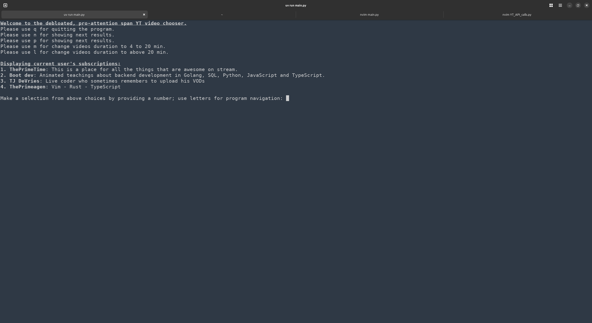
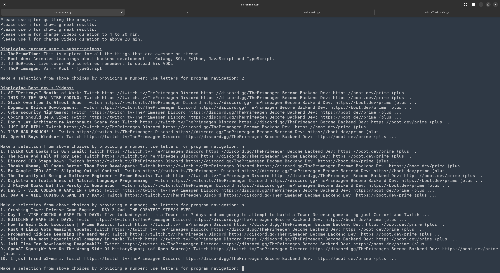

# YouTube Terminal App

This project is designed to be able to retrieve YouTube information and interact with it through the terminal. The currently this Youtube terminal app is to be able to display your subscriptions and watch videos from said subscriptions. It requires Youtube Data API v3 which this README will go over how to enable later. The later goals of this app is to make the CLI interface smoother, give an option to watch in browser or in CLI, let the user choose what length videos they would like returned, and more features listed at the bottom of this README.

**Examples**



## Installation

This project uses an automated installation script that handles all dependencies and setup.

### Quick Install

1. Clone the repository:
   ```bash
   git clone https://github.com/AtLeastFiveCats/Youtube-Notification-Bot.git
   cd Youtube-Notification-Bot
   ```

2. Run the installation script:
   ```bash
   chmod +x YT_install.sh
   ./YT_install.sh
   ```

The installation script will:
- Check if `uv` is installed and install it if needed
- Install all project dependencies with `uv sync`
- Create a global `YT_run.sh` command that you can run from anywhere

### Running the App

After installation, you can run the app in two ways:

**Option 1: Global command (recommended)**
```bash
YT_run.sh
```

**Option 2: From project directory**
```bash
./YT_run.sh
# or
uv run main.py
```

The global `YT_run.sh` command works from any directory and automatically handles the virtual environment.

## Manual Installation (Alternative)

If you prefer to install manually:

**Dependencies**

This project requires uv to run, it's a wonderful package manager and virtual environment tool packed into one.

For Linux and MacOS:
```bash
curl -LsSf https://astral.sh/uv/install.sh | sh
```
 
For Windows:
```powershell
powershell -ExecutionPolicy ByPass -c "irm https://astral.sh/uv/install.ps1 | iex"
```

To make sure it's installed, simply run `uv` - it should give a description and the different options. 

Then install dependencies:
```bash
uv sync
```

To run the project, navigate to the cloned root directory and type:
```bash
uv run main.py
```

This should error out initially as the API access hasn't been setup yet (see next section).

## Enabling API Access

The next piece of overhead for this is to enable access to Google's API, this is about a 5 minute process

1. Navigate to https://console.cloud.google.com

2. In the navigation pane on the lefthand side accessed by the three lines in the top left of the page, navigate to APIs & Services -> Credentials

3. Select 'Create New Project', it does not matter what you name it

4. Select 'Create credentials' a the top of the screen and select 'OAuth client ID'

5. Now we need to configure the consent screen, select the 'configure consent screen' at the right of the page. From here we can select 'Get Started' in the middle of the screen

6. We need to give a name to our app, 'YT Notifier' will work. Add your email as the support email below that and hit next, we will select 'External' for our audience, after hitting next we can enter our email address as the contact information for Google. Lastly we accept the user data policy and hit create

7. Navigate back to the APIs & Services -> Credentials and select 'Create credentials' -> 'OAuth client ID', choose 'Desktop app' for the Application Type and hit create, **don't close this page we will come back to it**

8. At the bottom of the OAuth client created box that pops up select 'Download JSON' and save it in the root of this project's directory, **make sure to rename it to YT.json**

9. If we attempt to authorize our script to make api calls we will get hit with an access denied. navigate back to the google cloud console, select the navigation pane and navigate to 'APIs & Services' -> 'OAuth consent screen'. That will take us to an overview of the app. from there navigate to the left and select 'Audience' -> '+ Add users' enter your email and save

10. Lastly if 'Youtube Data API v3' has not been used on your developer account it will need to be enabled Navigate back to the left navigation panel -> 'APIs & Services' -> 'Library' -> Scroll to 'Youtube' -> 'YouTube Data API v3' -> 'Enable'

**Potental Issues:**

If this error pops up
```
The logged account has no subscriptions, touched too much grass boi!
```

Then the account you authorized to use with the bot has no subscriptions

**Fix:**

Either add some subscriptions or delete the YT.pickle file and rerun the script to authorize a different account

------------------------------------------------------------------------------------------------------------

~~If the displayed videos are not the most recent videos uploaded from the channel then it is likely the newest videos are either too long or too short to be considered midform content and will not be displayed by the program. This is an issues we intend to fix down the line.~~ **(Fixed)**

**TODO**

- ~~Show more than 10 videos per channel~~ **(Fixed)**
- ~~Add the ability to page between videos~~ **(Fixed)**
- Refactor UI to be cleaner
- ~~Add more safety checks for improper input~~ **(Fixed)**
- ~~Add the option to display a different YouTube channel's videos~~ **(Fixed)**
- Add the ability to see shortform (-4 min), midform (4 - 20 min), or longform content (20+ min)
- Potentially add a way to be notified of a new upload from a subscription
- More coming down the pipeline
